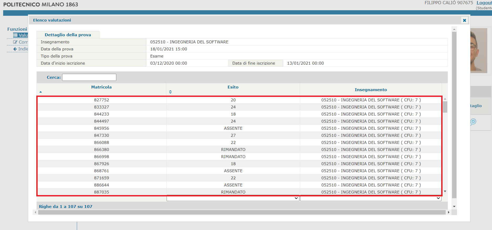

# PoliGradesAverage
Questo è uno script scritto in Python 3 che esegue il parsing del testo presente sui Servizi Online del Politecnico di Milano e salva in un file di testo alcune statistiche riguardo l'esame, facendo visualizzare un grafico con l'andamento dei voti.

I dati salvati nel file sono:
* Nome e CFU dell'insegnamento
* Data Esame (da inserire)
* Media dei voti
* Numero di persone che hanno fatto l'esame, numero di bocciati/rimandati/riprovati

## Requisiti
* Python 3
* Modulo `matplotlib.pyplot`, `re`

## Utilizzo dello script
Lo script accetta come input attraverso `file` (chiamato voti.txt) il testo contenente gli esiti dell'esame e visualizza a terminale i dati dell'esito. Il testo a cui si fa riferimento può essere ottenuto dalla sezione *Consultazione esito esami* dei [Servizi Online](https://www.polimi.it/servizionline/) del Politecnico. Il testo nel riquadro rosso nello scheenshot qui sotto è ciò che deve essere salvato in un file chiamato `voti.txt`, da salvare nella stessa cartella dello script `poligrades-downloader.py`.

## Scopo di questo script (disclaimer)
I dati ottenuti tramite questo script possono essere usati per fini statistici. Questo script non è stato pensato per violare la privacy degli studenti e lo sviluppatore non incoraggia nessuno a farlo. Una volta ottenuti i dati, l'utente è completamente responsabile dell'utilizzo che ne fa.
